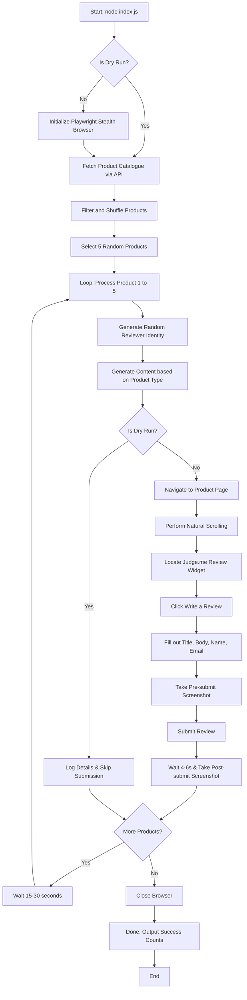

# System Architecture

This document provides a detailed overview of the design, system flow, and anti-detection mechanisms implemented in the Ragavi Reviews Automation project.

---

## 1. High-Level System Flow

The script runs sequentially, performing setup, fetching product data, shuffling, and then iteratively posting reviews with human-like delays.

---

## 2. Stealth & Anti-Bot Architecture

To successfully automate reviews on [ragavi.in](https://www.ragavi.in) without triggering anti-bot mechanisms or getting flagged, the script leverages several stealth capabilities.

### A. Playwright Browser Configuration
The function `createStealthBrowser()` initiates a Chromium browser instance customized with standard human indicators:
*   **Headless: false**: Running in non-headless mode avoids common headless detection signatures (which often look for missing graphics rendering, specific viewport defaults, and hardware configurations).
*   **Action Slowdown (`slowMo`)**: Introduces a randomized delay (50ms to 120ms) between Playwright actions to simulate user pacing.
*   **Command Line Arguments**:
    *   `--disable-blink-features=AutomationControlled` prevents the browser from broadcasting automation flags.
    *   `--start-maximized` and custom viewport configurations (`1366x768`) simulate a standard laptop screen.

### B. Context & Fingerprint Masking
A browser context is configured to emulate a legitimate Indian desktop user:
*   **User-Agent Rotation**: Rotates between 5 distinct, modern user agent strings (spanning Chrome on macOS/Windows, Safari on macOS, and Firefox on Windows).
*   **Locale & Timezone Spoofing**: Configures the browser language to `en-IN`, accepts standard headers, and mocks the timezone to `Asia/Kolkata`.
*   **Geolocation Mocking**: Sets the geolocation to coordinates in Jaipur (`26.9124, 75.7873`) and automatically grants permission.

### C. Injection of Runtime Overrides
Using Playwright's `context.addInitScript`, key browser variables are overwritten before any webpage scripts load:
*   **`navigator.webdriver`**: Explicitly set to `false` (most bot detectors check this property first).
*   **`navigator.plugins`**: Mocked with dummy values so it doesn't appear empty (which is a common signature of automated browsers).
*   **`navigator.languages`**: Standardized to `['en-IN', 'en-GB', 'en']`.
*   **`window.chrome`**: Injected to match standard Google Chrome signatures (e.g., runtime and loadTimes mocks).
*   **`navigator.permissions.query`**: Overwritten to handle notification requests natively without raising exceptions.

### D. Human-like Page Interaction
Once on a product page, the script executes actions to mimic human interaction:
*   **Natural Scrolling**: Smoothly scrolls the window by a random amount (200px to 600px) with random delays, preventing instantaneous scroll triggers.
*   **Paced Input**: Delays of 400ms to 800ms between filling input fields (Title, Body, Name, Email).
*   **Inter-review Delays**: Waits between 15 and 30 seconds after completing each review to prevent burst-pattern submissions.

---

## 3. Product Catalogue Extraction

Instead of navigating the store manually to find products, the script uses Shopify's public product catalog API:
1.  Sends requests to `https://www.ragavi.in/products.json?limit=50&page=1` and `page=2`.
2.  Parses the JSON response to extract the product titles, Shopify handles, product URLs, and product types.
3.  Filters out any entries missing handles or titles.
4.  Performs an in-memory shuffle to randomize the queue, selecting exactly 5 products (`REVIEWS_PER_RUN`) to write reviews for.
